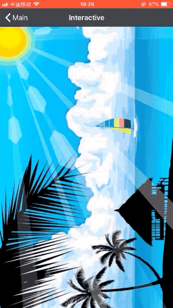
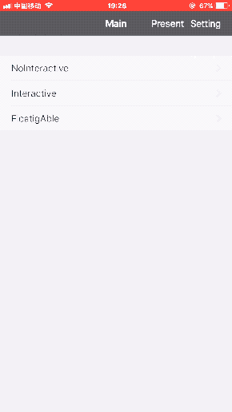

# LMFloatingKeeper

一个为控制器添加自定义的Transition动画和侧滑返回效果的库。并实现了微信的侧滑浮窗效果(包括侧滑中显示右下角按钮，选中按钮后的飞入效果。悬浮球的效果没有做,但内部预留有扩展的接口,已有该效果的可以方便的添加进去)。

该库的目的做成一个方便扩展，低耦合的转场和侧滑动画的库, 后面会添加对present的支持，以及会增加更多的动画效果。

## 效果图如下



## 介绍
使用方法比较简单，低耦合。只需要几行代码，即可使应用拥有自定义的转场动画和侧滑返回效果。

## 使用说明

#### step1 给NavigationController 设置delegate

  ```swift
    //下面是NavigationController viewDidLoad 方法
    override func viewDidLoad() {
        super.viewDidLoad()
        let control = GeneralTransitionControl()
        delegate = control
        self.control = control
    }
        
  ```
  当前直接创建GeneralTransitionControl，会使用默认的动画效果，如果需要修改则需要改变初始化的方式
  ```swift
  
        //transaction动画，目前有FrameAniTransitionProducer 和 AppleAniTransitionProducer 后续会进行扩展
        let transactionProducer = FrameAniTransitionProducer()
        //设置动画效果
        transactionProducer.underAnimationType = .pushed
        transactionProducer.uponAnimationType = .fromLeft
        
        //interactive动画
        let interactiveProducer = GeneralInteractiveProducer()
        
        let control = GeneralTransitionControl(aniTransitionProducer: transactionProducer, interactiveProducer: interactiveProducer)

  ```
  
  如需要使用微信浮窗效果则使用 FloatingKeeperControl
  ```swift
        let control = FloatingKeeperControl()
        // 设定需要动画效果
        control.floatingTransitionProducer.underAnimationType = .squeezed
        control.floatingTransitionProducer.uponAnimationType = .fromLeft
    
  ```
  
#### step2 给需要侧滑效果的ViewController添加侧滑手势
  ```swift
  
  override func viewDidLoad() {
        super.viewDidLoad()
        
        /// 默认的手势是左侧，向右侧滑。
        /// 如果你的设置的Transition动画是从左侧push，则这里设定为.right
        if let gesture = self.lm.interactivePop(.left) {
            view.addGestureRecognizer(gesture)
        }
    }
  ```

#### step3 实现FloatingKeepAble
该步骤仅针对FloatingKeeperControl, 实现该协议的UIViewController，将会有微信浮窗效果

```swift
// 支持微信浮窗效果的侧滑返回
class FloatingAbleViewController: UIViewController, FloatingKeepAble {
    // your implemention
}
  ```
  
## Tips
  针对已有悬浮球效果，想添加进去形成完整的微信浮窗效果
  ```swift
 //实现 FloatingBarManagerType 协议，然后
 FloatingKeeperManager.shared.floatingBarManager = your floating bar manager
  
  ```
  
## 许可证

LMFloatingKeeper 是基于 MIT 许可证下发布的，详情请参见 LICENSE。
